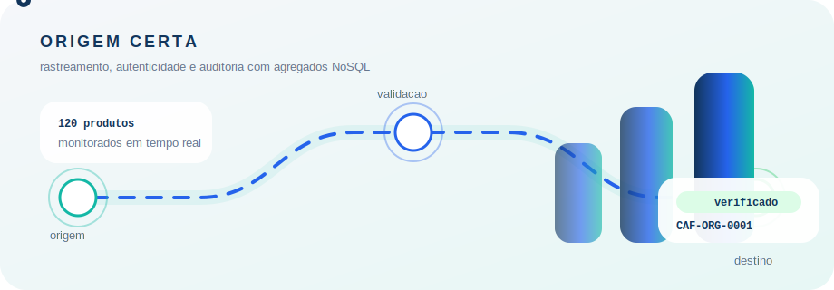

# Origem Certa: Rastreamento e Vigilancia de Cadeia de Suprimentos

Projeto academico de Banco de Dados NoSQL para modelar e demonstrar um sistema de rastreamento, verificacao de autenticidade e vigilancia de produtos ao longo da cadeia de suprimentos.

<p align="center">
  
</p>

## Ideia do sistema

O sistema **Origem Certa** acompanha produtos, lotes, locais, movimentacoes, notas fiscais, alertas e usuarios autorizados. A proposta e permitir que uma organizacao consulte rapidamente a origem de um produto, acompanhe sua rota logistica e identifique sinais de fraude, desvio ou divergencia documental.

Na pratica, o sistema responde perguntas como:

- onde este produto esta agora?
- por quais locais ele passou?
- qual lote esta relacionado a esta nota fiscal?
- houve divergencia de quantidade?
- qual movimentacao gerou um alerta?
- qual usuario registrou ou auditou a ocorrencia?

## Motivacao para usar NoSQL

A cadeia de suprimentos gera dados heterogeneos, com eventos constantes e historicos que crescem rapidamente. Produtos, lotes, movimentacoes, alertas e documentos fiscais possuem estruturas relacionadas, mas nem sempre seguem um formato rigido.

Por isso, um banco NoSQL orientado a documentos, como o MongoDB, e adequado para este projeto. Ele permite:

- armazenar documentos flexiveis;
- aproximar dados consultados juntos com frequencia;
- manter historicos extensos em colecoes proprias;
- escalar consultas de rastreamento e auditoria;
- representar agregados de forma mais natural que uma modelagem puramente relacional.

A modelagem segue a ideia de **agregados**: dados usados juntos nas consultas principais ficam proximos, enquanto dados volumosos ou reutilizaveis ficam em colecoes independentes e sao referenciados por campos naturais, como `codigo`, `lote`, `produto`, `nota_fiscal` e `email`.

## Modelagem NoSQL

A modelagem completa esta no arquivo [modelagem_nosql.md](./modelagem_nosql.md).

<p align="center">
  
</p>

As colecoes principais da modelagem sao:

- `lotes`: agrupa produtos com origem, destino, quantidade, nota fiscal e risco.
- `produtos`: documento central para consulta rapida de status, localizacao, ultimas movimentacoes e alertas ativos.
- `movimentacoes`: historico de eventos logisticos, como saida, entrada, transporte e entrega.
- `alertas`: anomalias detectadas, com gravidade, status e responsavel pela auditoria.
- `locais`: fabricas, armazens, transportadoras, centros de distribuicao, lojas e pontos de entrega.
- `usuarios`: operadores, auditores e gestores autorizados a registrar ou consultar dados sensiveis.
- `notas_fiscais`: documentos fiscais usados para validacao de quantidade, destino e possivel reutilizacao indevida.

## Como a agregacao foi pensada

O agregado mais importante e o de **Produto**, porque grande parte das consultas parte do codigo do produto. O documento de produto mantem dados de leitura rapida, como:

- status atual;
- localizacao atual;
- lote relacionado;
- ultimas movimentacoes;
- alertas ativos.

O historico completo de movimentacoes fica em colecao propria, pois pode crescer muito. Alertas tambem ficam separados porque possuem ciclo de vida proprio: podem ser abertos, analisados, confirmados, descartados ou resolvidos.

Usuarios, locais e notas fiscais sao colecoes auxiliares por referencia. Isso evita repeticao excessiva e facilita auditoria, validacao documental e controle de acesso.

## Resumo tecnico

Arquitetura do projeto:

```text
Frontend estatico -> API REST FastAPI -> MongoDB Atlas
```

Tecnologias usadas:

- **Frontend:** HTML, CSS e JavaScript puro.
- **Backend:** Python com FastAPI.
- **Banco de dados:** MongoDB Atlas.
- **Driver MongoDB:** Motor.
- **Deploy da API:** Render.
- **Deploy do frontend:** hospedagem estatica.

Principais endpoints:

```text
GET /api/stats
GET /api/produtos
GET /api/produtos/{codigo}
GET /api/lotes
GET /api/movimentacoes
GET /api/alertas
GET /api/locais
GET /api/notas-fiscais
```

## Estrutura do projeto

```text
backend/
  main.py
  seed_data.py
  requirements.txt
frontend/
  index.html
  styles.css
  script.js
  app.js
  favicon.svg
files/
  modelagem.svg
  tracking-animation.svg
modelagem_nosql.md
README.md
```

## Como executar o backend

Entre na pasta `backend`:

```bash
cd backend
```

Instale as dependencias:

```bash
pip install -r requirements.txt
```

Crie um arquivo `.env` com a conexao do MongoDB:

```env
MONGODB_URI=***
MONGODB_DB=***
FRONTEND_ORIGINS=***
```

Popule o banco:

```bash
python seed_data.py
```

Execute a API:

```bash
uvicorn main:app --reload
```

A API ficara disponivel em:

```text
http://127.0.0.1:8000
```

Documentacao interativa:

```text
http://127.0.0.1:8000/docs
```

## Como executar o frontend

Abra o arquivo abaixo no navegador ou publique a pasta `frontend/` em uma hospedagem estatica:

```text
frontend/index.html
```

No arquivo `frontend/app.js`, configure a URL da API:

```js
const API_BASE_URL = "https://sua-api-publicada.com";
```

## Massa de dados

O script `backend/seed_data.py` cria dados de exemplo para demonstrar o sistema:

```text
120 lotes
120 produtos
240 movimentacoes
120 alertas
120 locais
120 notas fiscais
```

Esses dados alimentam os indicadores, listas e detalhes exibidos no site.

## Controle de acesso

A modelagem inclui a colecao `usuarios`, pensada para operadores, auditores e gestores. No frontend atual existe uma simulacao visual com o botao **Entrar como operador**.

Em uma versao completa, o fluxo recomendado seria:

```text
Usuario autorizado -> Login -> Token JWT -> Requisicoes autenticadas
```

Perfis sugeridos:

- `visitante`: consulta status basico de produto.
- `operador`: registra movimentacoes e acompanha lotes.
- `auditor`: analisa alertas e inconsistencias.
- `gestor`: acompanha indicadores e relatorios.

Rotas como alertas, notas fiscais e criacao de movimentacoes devem exigir autenticacao em uma versao de producao.

## Objetivo academico

O trabalho demonstra como a modelagem NoSQL por agregados pode ser aplicada em um problema realista de rastreamento de cadeia de suprimentos. A proposta une modelagem documental, consultas por agregados, referencias naturais e uma interface visual para demonstrar o funcionamento do sistema.
