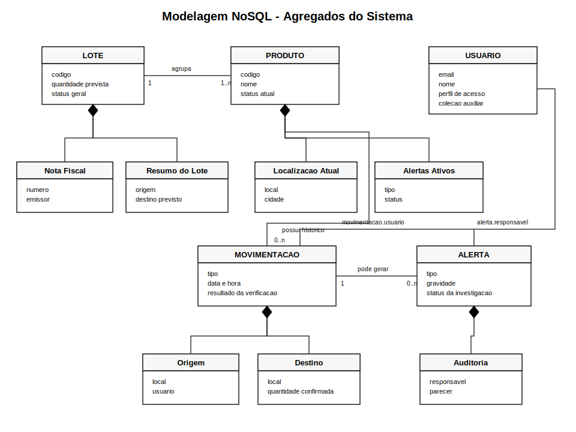

# Modelagem NoSQL: Hierarquia de Informações e Agregações
**Sistema: Rastreamento e Vigilância de Cadeia de Suprimentos**

---

## 1. Hierarquia de Informações e Agregações



---

A funcionalidade principal do sistema é rastrear a jornada de produtos e lotes ao longo de toda a cadeia de suprimentos, identificando comportamentos suspeitos que possam indicar fraude, desvio, perda, divergência de quantidade ou inconsistência documental.

Como o objetivo do sistema é responder rapidamente perguntas como **"onde está este produto?"**, **"por onde ele passou?"**, **"qual lote está comprometido?"** e **"qual movimentação gerou o alerta?"**, a modelagem NoSQL deve ser organizada a partir dos agregados mais consultados.

Neste projeto, o centro da modelagem é o conjunto **Lote + Produto**, pois os produtos são rastreados individualmente, mas muitas decisões logísticas e fiscais acontecem no nível do lote.

### 1.1 Hierarquia principal

```text
Cadeia de Suprimentos
-> Organizações e Locais
   -> Fornecedores
   -> Fabricantes
   -> Armazéns
   -> Transportadoras
   -> Centros de Distribuição
   -> Lojas / Clientes
-> Lotes
   -> Produtos ou Itens Rastreados
      -> Movimentações
         -> Verificações Automáticas
            -> Alertas
               -> Auditorias
```

Essa hierarquia representa a forma como as informações se conectam no sistema. A cadeia de suprimentos é composta por organizações e locais. Os lotes agrupam produtos com origem, fabricação, documentação ou destino semelhantes. Cada produto possui uma identidade própria e registra sua trajetória por meio de movimentações. As movimentações são analisadas por regras automáticas e, quando alguma inconsistência é encontrada, o sistema gera alertas para auditoria.

### 1.2 Agregado LOTE

O lote representa um grupo de produtos que compartilham origem, fabricação, documentação ou rota logística. Ele é importante porque muitas operações da cadeia de suprimentos acontecem em conjunto, como envio de caixas, paletes, cargas e notas fiscais.

O agregado de lote deve reunir:

- dados principais do lote;
- origem e destino esperado;
- fabricante ou fornecedor;
- documentos fiscais associados;
- lista resumida de produtos vinculados;
- status geral do lote;
- indicadores de risco do lote.

Esse agregado ajuda em consultas como:

- quais produtos pertencem a este lote?
- o lote chegou completo ao destino?
- existe divergência entre quantidade enviada e quantidade recebida?
- algum produto do lote gerou alerta?

### 1.3 Agregado PRODUTO

O produto é o principal objeto de rastreamento do sistema. Ele representa o item monitorado individualmente e concentra as informações mais importantes para consultas rápidas.

O agregado de produto deve reunir:

- dados cadastrais do produto;
- lote relacionado;
- status atual;
- localização atual;
- responsável pelo último registro;
- últimas movimentações;
- alertas ativos.

O produto funciona como documento central porque a maioria das consultas do sistema parte dele. Por exemplo: verificar onde o produto está agora, conferir por quais locais passou e identificar se possui alguma suspeita ativa.

### 1.4 Agregado MOVIMENTAÇÃO

A movimentação representa cada evento logístico ocorrido com um produto ou lote, como saída da fábrica, entrada no armazém, transferência, transporte, conferência, entrega ou devolução.

Como um produto pode ter muitas movimentações ao longo do tempo, elas devem ficar em uma coleção própria. O documento de produto pode manter apenas um resumo das últimas movimentações, enquanto o histórico completo fica separado para auditoria e análise.

O agregado de movimentação deve reunir:

- produto ou lote movimentado;
- tipo de evento;
- origem e destino;
- data e hora;
- localização registrada;
- responsável pelo registro;
- nota fiscal relacionada;
- resultado da verificação automática.

Esse agregado permite detectar situações como deslocamento impossível, produto em dois lugares ao mesmo tempo, saída fora do horário permitido ou divergência de quantidade.

### 1.5 Agregado ALERTA

O alerta registra uma anomalia detectada pelo sistema. Ele possui ciclo de vida próprio, pois pode ser aberto, analisado, confirmado, descartado ou resolvido.

O agregado de alerta deve reunir:

- tipo de anomalia;
- grau de risco;
- produto ou lote relacionado;
- movimentação suspeita;
- descrição da inconsistência;
- data de emissão;
- status da investigação;
- responsável pela auditoria.

Os alertas devem ficar em coleção própria porque são consultados por auditores, gestores e responsáveis pela segurança da cadeia de suprimentos. Além disso, uma única movimentação pode gerar mais de um alerta.

### 1.6 Coleções auxiliares por referência

Algumas informações são compartilhadas por muitos produtos, lotes e movimentações. Por isso, devem ser mantidas em coleções independentes e relacionadas por referência.

#### LOCAIS

Armazéns, fábricas, centros de distribuição, transportadoras, lojas e pontos de entrega são reutilizados por muitas movimentações. Mantê-los em coleção própria evita repetição excessiva e permite consultas por cidade, estado, tipo de local ou rota.

#### USUÁRIOS

Usuários representam operadores, auditores, gestores e responsáveis pelos registros. Como dados como cargo, e-mail e setor podem mudar, é melhor manter usuários em uma coleção separada.

#### NOTAS_FISCAIS

Notas fiscais devem ser armazenadas separadamente para permitir validação de unicidade, reaproveitamento indevido, divergência de quantidade e conferência documental.

---

## 2. Descrição e Exemplo de Documento por Coleção

### Coleção: LOTES

```json
{
  "codigo": "LOTE-CAF-2026-001",
  "produto_base": "Café Orgânico 500g",
  "fabricante": "Fazenda Minas Verdes LTDA",
  "origem": "Fábrica Minas Verdes",
  "destino_previsto": "Loja Ribeirão Preto",
  "quantidade_prevista": 500,
  "quantidade_confirmada": 498,
  "status": "em_transito",
  "nota_fiscal": "NF-2026-00187",
  "indicadores_risco": {
    "possui_alerta": true,
    "nivel_risco": "medio"
  }
}
```

### Coleção: PRODUTOS

```json
{
  "codigo": "CAF-ORG-0001",
  "nome": "Café Orgânico 500g",
  "categoria": "alimentos",
  "lote": "LOTE-CAF-2026-001",
  "fabricante": "Fazenda Minas Verdes LTDA",
  "status_atual": "em_transito",
  "localizacao_atual": {
    "nome": "Armazém Central Uberlândia",
    "cidade": "Uberlândia",
    "estado": "MG"
  },
  "ultima_movimentacao": "entrada_armazem",
  "ultimas_movimentacoes": [
    {
      "tipo": "saida_fabrica",
      "data_hora": "2026-06-10T08:30:00Z",
      "local": "Fábrica Minas Verdes"
    },
    {
      "tipo": "entrada_armazem",
      "data_hora": "2026-06-11T14:20:00Z",
      "local": "Armazém Central Uberlândia"
    }
  ],
  "alertas_ativos": [
    {
      "tipo": "divergencia_quantidade",
      "gravidade": "media",
      "status": "em_analise"
    }
  ]
}
```

### Coleção: MOVIMENTACOES

```json
{
  "produto": "CAF-ORG-0001",
  "lote": "LOTE-CAF-2026-001",
  "tipo": "entrada_armazem",
  "status_resultante": "armazenado",
  "data_hora": "2026-06-11T14:20:00Z",
  "origem": "Fábrica Minas Verdes",
  "destino": "Armazém Central Uberlândia",
  "usuario": "João da Silva",
  "nota_fiscal": "NF-2026-00187",
  "quantidade_informada": 500,
  "quantidade_confirmada": 498,
  "verificacao": {
    "resultado": "suspeito",
    "motivos": [
      "quantidade_confirmada_diferente_da_quantidade_informada"
    ]
  }
}
```

### Coleção: ALERTAS

```json
{
  "tipo": "divergencia_quantidade",
  "descricao": "Quantidade recebida no armazém é menor que a quantidade informada na nota fiscal.",
  "gravidade": "media",
  "status": "em_analise",
  "produto": "CAF-ORG-0001",
  "lote": "LOTE-CAF-2026-001",
  "movimentacao": "entrada_armazem",
  "data_emissao": "2026-06-11T14:21:05Z",
  "responsavel_auditoria": "Maria Oliveira"
}
```

### Coleção: LOCAIS

```json
{
  "nome": "Armazém Central Uberlândia",
  "tipo": "armazem",
  "cidade": "Uberlândia",
  "estado": "MG",
  "pais": "Brasil",
  "coordenadas": {
    "latitude": -18.9186,
    "longitude": -48.2772
  }
}
```

### Coleção: USUARIOS

```json
{
  "nome": "João da Silva",
  "cargo": "Operador de Armazém",
  "email": "joao.silva@empresa.com",
  "perfil": "operador"
}
```

### Coleção: NOTAS_FISCAIS

```json
{
  "numero": "NF-2026-00187",
  "emissor": "Fazenda Minas Verdes LTDA",
  "destinatario": "Loja Ribeirão Preto",
  "data_emissao": "2026-06-10T07:50:00Z",
  "quantidade_declarada": 500,
  "valor_total": 7500.00,
  "status_validacao": "valida"
}
```

---

## 3. Exemplo de Agregado para Consulta Rápida

O exemplo abaixo representa uma visão agregada do produto. Ele não precisa substituir todas as coleções, mas mostra como o sistema pode montar uma resposta rápida para consultas frequentes.

```json
{
  "codigo": "CAF-ORG-0001",
  "nome": "Café Orgânico 500g",
  "categoria": "alimentos",
  "lote": {
    "codigo": "LOTE-CAF-2026-001",
    "status": "em_transito"
  },
  "status_atual": "armazenado",
  "localizacao_atual": {
    "nome": "Armazém Central Uberlândia",
    "cidade": "Uberlândia",
    "estado": "MG"
  },
  "historico_recente": [
    {
      "tipo": "saida_fabrica",
      "data_hora": "2026-06-10T08:30:00Z",
      "local": "Fábrica Minas Verdes",
      "responsavel": "João da Silva"
    },
    {
      "tipo": "entrada_armazem",
      "data_hora": "2026-06-11T14:20:00Z",
      "local": "Armazém Central Uberlândia",
      "responsavel": "João da Silva",
      "verificacao": {
        "resultado": "suspeito",
        "motivos": [
          "divergencia_quantidade"
        ]
      }
    }
  ],
  "alertas_ativos": [
    {
      "tipo": "divergencia_quantidade",
      "gravidade": "media",
      "status": "em_analise",
      "descricao": "Quantidade recebida menor que a quantidade informada na nota fiscal."
    }
  ]
}
```

---

## 4. Justificativa da Modelagem NoSQL

A modelagem proposta combina **documentos agregados** e **referências**. Dados acessados juntos com frequência, como status atual, localização atual, últimas movimentações e alertas ativos, ficam próximos no documento de produto. Já dados volumosos ou reutilizáveis, como histórico completo de movimentações, locais, usuários, notas fiscais e alertas detalhados, ficam em coleções próprias.

Essa decisão evita documentos muito grandes, reduz duplicações desnecessárias e mantém o sistema eficiente para consultas em tempo real. Ao mesmo tempo, preserva o histórico completo necessário para auditorias.

Portanto, a modelagem mais adequada para o sistema é:

- **Produto e lote** como centro da agregação;
- **Movimentações** como eventos rastreáveis;
- **Alertas** como registros independentes de risco e auditoria;
- **Locais, usuários e notas fiscais** como coleções auxiliares referenciadas.

Essa estrutura se encaixa bem em bancos NoSQL orientados a documentos porque prioriza flexibilidade de esquema, escalabilidade horizontal e leitura rápida de informações relacionadas.
